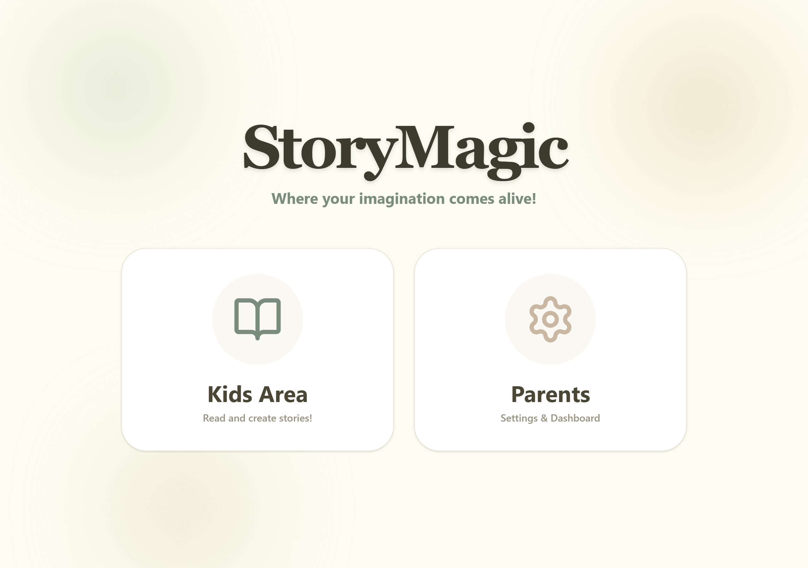
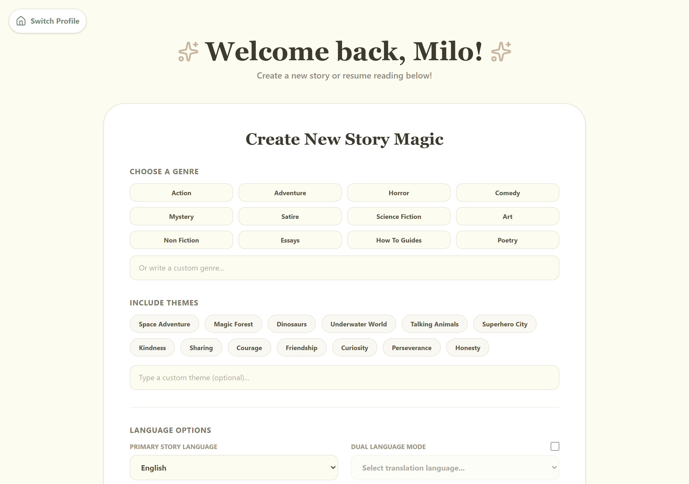
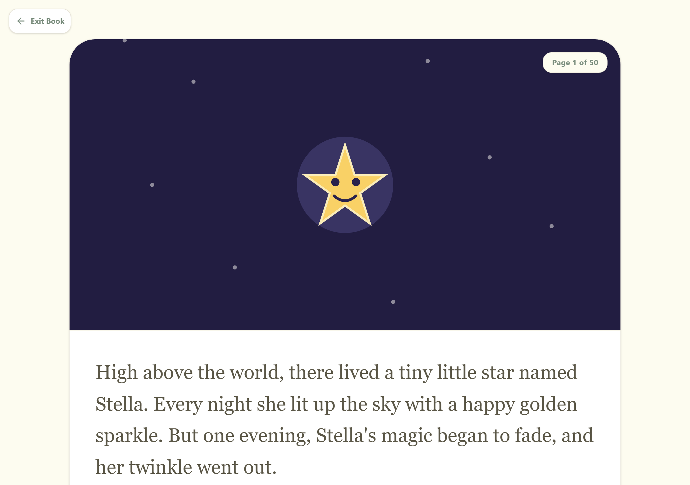
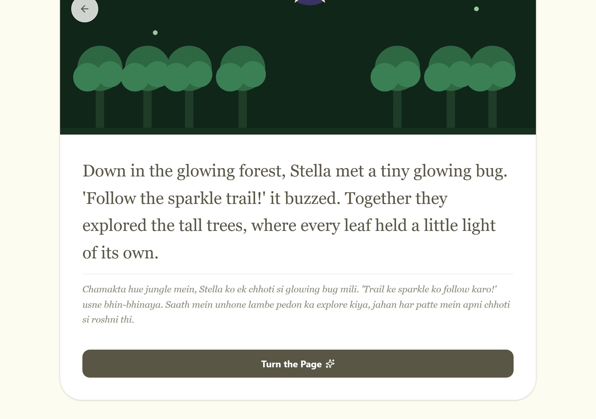
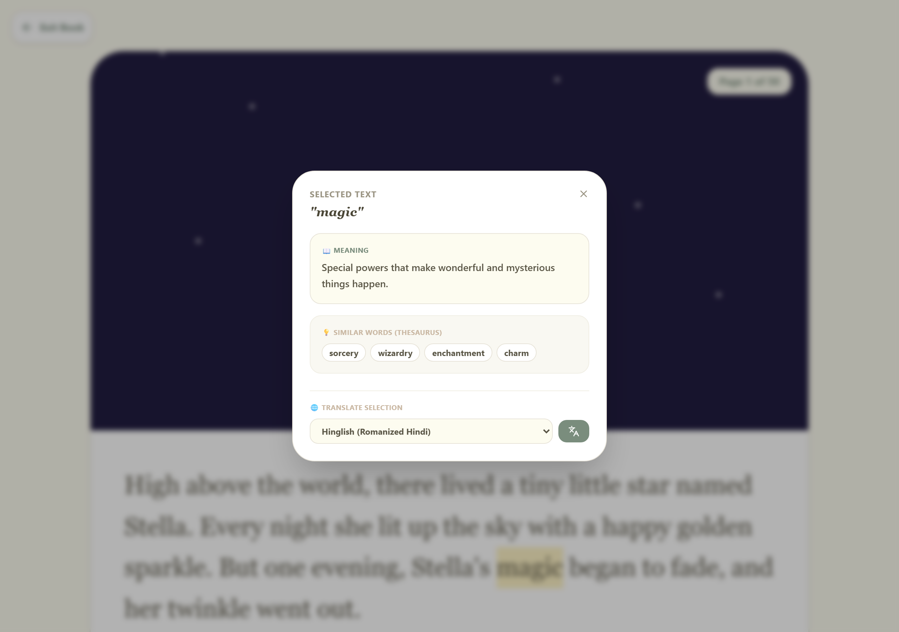
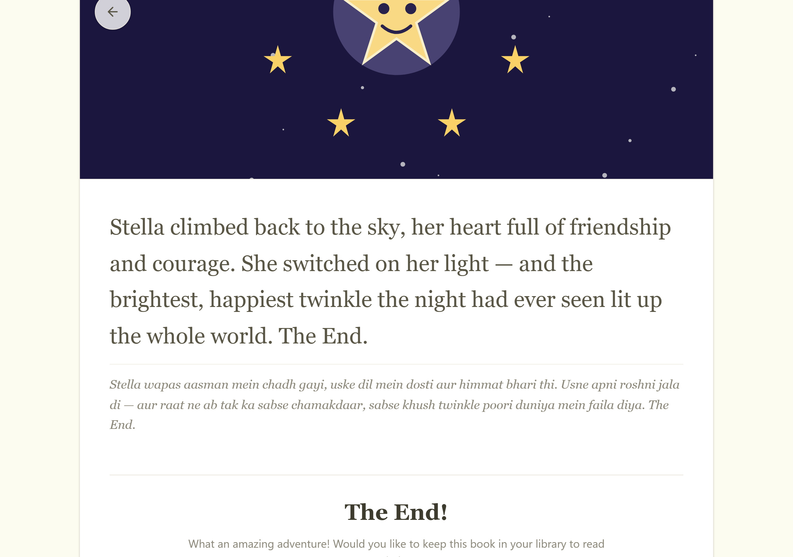
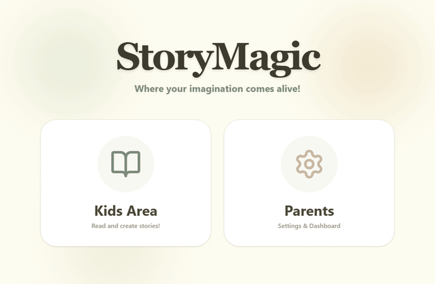
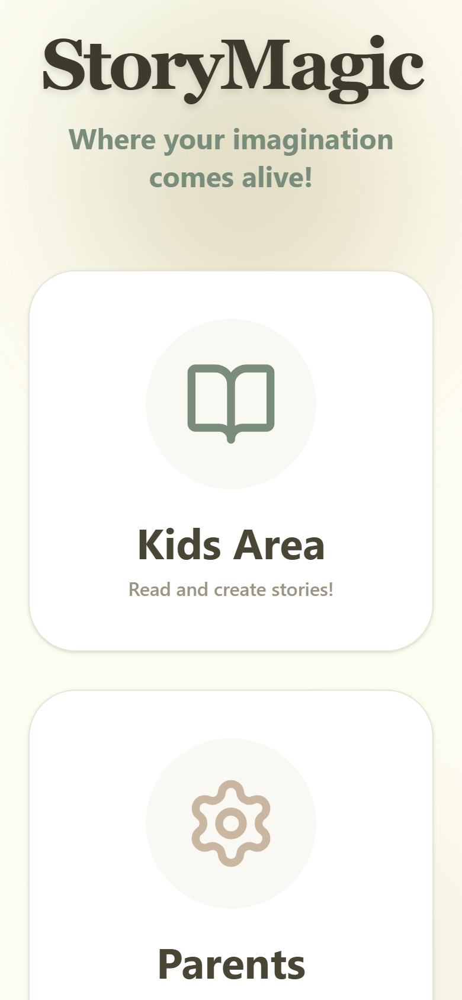

# StoryMagic — Open-Source, Local-First AI Bedtime Stories

Turn any idea into a beautifully illustrated, multilingual children's storybook.
StoryMagic generates narrative, illustrations, word definitions, and translations
through a **provider-agnostic AI router** with built-in fallback — so it never
hard-fails on a quota block or API outage.

- **Privacy-first for kids.** Run it on **local Ollama** and no story data leaves the
  machine. Cloud providers are optional and follow their own ToS (see [PRIVACY.md](PRIVACY.md)).
- **Open source & self-hostable.** Clone it, read the router code, contribute.
- **Free to use.** Parents don't pay per story; developers self-host for $0.
- **Resilient by design.** Configurable provider chain with automatic fallback and a
  circuit breaker.

> ⚠️ **Try it live (no clone, no key):** **[DEMO LINK]** — a read-only demo running a
> bundled sample story. For live AI generation, self-host and add a provider key.

## Screenshots

> Captured from a real running build (Demo Mode). The sample story is
> *"The Little Star Who Found Her Twinkle."*

| Landing | Story creator | Reading view |
| --- | --- | --- |
|  |  |  |

| Dual-language page | Tap-to-define (offline) | Story complete |
| --- | --- | --- |
|  |  |  |

### Demo



_Mobile responsive:_ 

## Features

- AI-generated illustrated children's stories from a simple prompt
- Multilingual / dual-language translation of any story page (e.g. English + Hinglish)
- Built-in child-safe word definitions (offline local dictionary + provider fallback)
- AI image generation per scene (when an image-capable provider is configured)
- Parental filtering on generated content
- One-click publish to web / ebook / print-ready formats

## Quick start

**Prerequisites:** Node.js 20+

1. Install dependencies:
   `npm install`
2. Configure a model provider (no key is required to boot — see provider priority below):
   - Copy `.env.example` to `.env` and set any of `SM_PROVIDER_GEMINI_API_KEY`,
     `SM_PROVIDER_OPENAI_API_KEY`, `SM_PROVIDER_ANTHROPIC_API_KEY`, or
     `SM_PROVIDER_LOCAL_BASE_URL` (Ollama). See `ROUTER_README.md` for the full reference.
3. Run the app:
   `npm run dev`

StoryMagic routes all AI generation through the provider-agnostic model router
(`src/router/`). It boots with zero keys and falls back across providers if one is
blocked or exhausted. See `ROUTER_README.md` for configuration and block-overcoming details.

## Privacy note

- **Local mode (Ollama only):** the prompt, story text, and images never leave your
  machine. Nothing is sent to any third party. **This is the recommended mode for privacy.**
- **Cloud mode (Gemini / OpenAI / Anthropic / Nous / OpenRouter):** story content is sent
  to that provider and is governed by their terms of service and privacy policy.
- **Analytics are opt-in and off by default.** The only instrumentation is a silent no-op
  unless you explicitly set a measurement backend; it never sends story text or child data.
  See [PRIVACY.md](PRIVACY.md) for the precise data-flow and how to verify it.
- We do not run our own telemetry on story content. If you self-host, you control the data.

> **Accuracy note:** the default provider chain is *cloud-first*; running 100% offline
> requires configuring **only** local Ollama (no cloud keys). Don't claim "offline by
> default" — claim "offline when you choose local Ollama." Full detail in PRIVACY.md §2.

## Deploy the read-only demo

A zero-key, zero-egress static demo (bundled sample story + inline SVG art) is one build
away. See [DEPLOY.md](DEPLOY.md) for Cloudflare Pages / GitHub Pages / Netlify recipes.

```bash
STORYMAGIC_DEMO=true npm run build   # -> ./dist (static, no backend)
```

## Docs

- `GUIDE.md` — full user guide
- `ROUTER_README.md` — model router configuration, provider priority, and fallback
- `ROUTER_README.md` — how to overcome provider blocks / quota limits
- `PRIVACY.md` — precise data-flow and privacy claims (read before any "privacy-first" marketing)
- `DEPLOY.md` — free-tier live demo deployment
- `LAUNCH_KIT.md` — launch copy, demo assets, honesty flags

## Contributing

Pull requests welcome. The model router is the core piece of engineering — see
`ROUTER_README.md` before changing provider logic.

## License

[MIT](LICENSE) — free for personal and commercial use.
